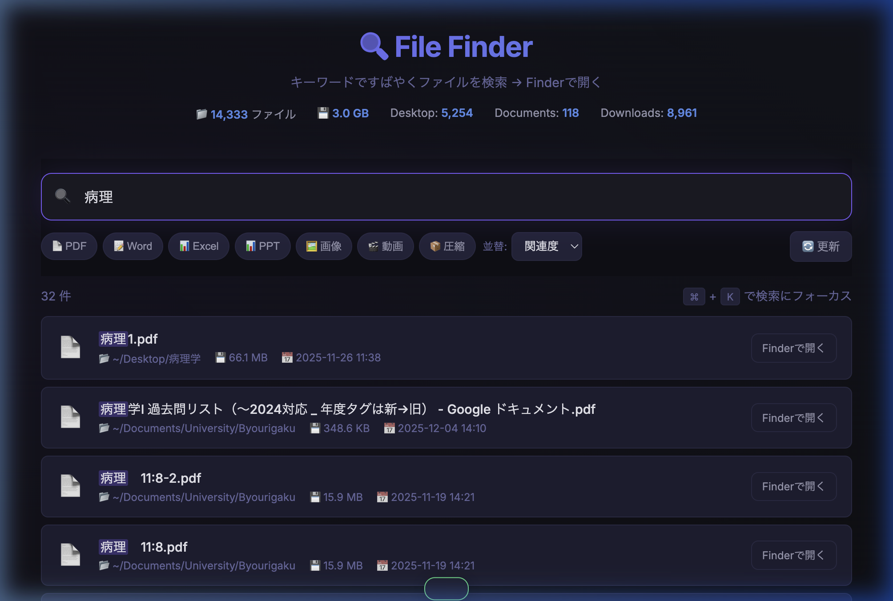

# 🔍 File Finder

ローカルファイルを素早く検索し、Finderで開ける軽量Webアプリ。  
外部ライブラリ不要 — Python標準ライブラリだけで動作します。



## ✨ 特徴

- **リアルタイム検索** — キーワードを入力するだけで即座に結果表示
- **Finderで開く** — 検索結果をワンクリックでFinderに表示
- **カテゴリフィルタ** — PDF / Word / Excel / 画像 / 動画 などワンクリック絞り込み
- **ソート** — 関連度・日付・名前・サイズで並び替え
- **キーボードショートカット** — `⌘K` でフォーカス、`Esc` でクリア
- **ゼロ依存** — Python 3 標準ライブラリのみ（pip install 不要）

## 🚀 使い方

```bash
# サーバーを起動
python3 server.py

# ブラウザで開く
open http://localhost:8765
```

または `launcher.sh` を実行すると、サーバー起動 → ブラウザ表示を一括で行います。

```bash
bash launcher.sh
```

### macOS アプリとして使う

`.app` バンドルを作成すれば、デスクトップアイコンのダブルクリックで起動できます。  
詳しくは [Wiki](../../wiki) を参照してください。

## 🔧 設定

`server.py` 内の `SEARCH_DIRS` を編集して、検索対象ディレクトリを変更できます:

```python
SEARCH_DIRS = [
    Path.home() / "Desktop",
    Path.home() / "Documents",
    Path.home() / "Downloads",
]
```

## 📁 構成

```
file-finder/
├── server.py      # APIサーバー（検索・Finder連携・インデックス）
├── index.html     # フロントエンド（ダークテーマUI）
└── launcher.sh    # ワンコマンド起動スクリプト
```

## 🛠 技術構成

| 項目 | 技術 |
|------|------|
| バックエンド | Python `http.server` + `json` |
| フロントエンド | Vanilla HTML / CSS / JavaScript |
| フォント | [Inter](https://fonts.google.com/specimen/Inter) (Google Fonts) |
| デザイン | ダークテーマ、グラスモーフィズム |

## 📝 ライセンス

MIT
